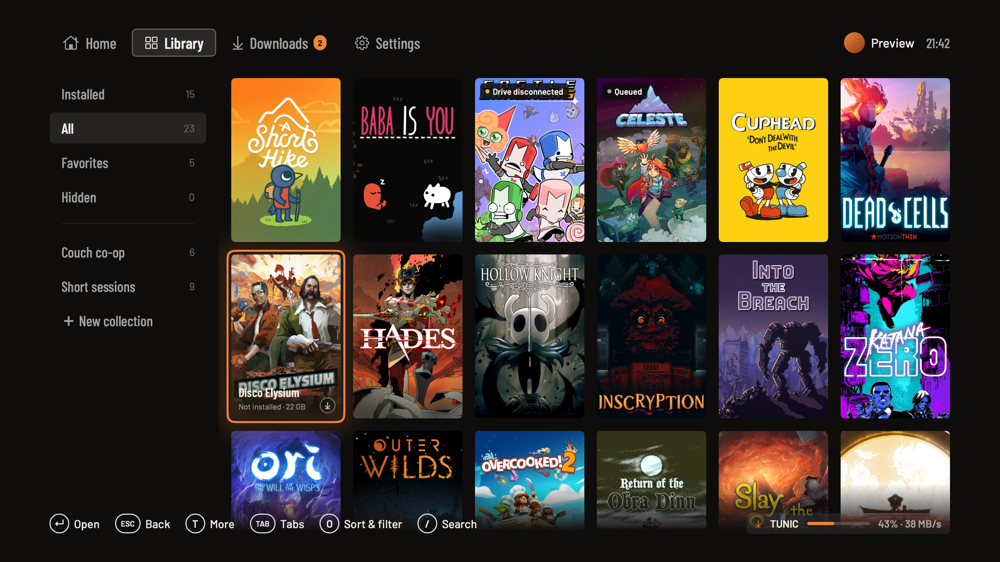

# Playden

**Windows games on your Mac, from the couch.**

Playden is a controller-first launcher for your Steam library on Apple Silicon. It installs
each Windows game into its own [CrossOver](https://www.codeweavers.com/crossover) environment
and gets you from the sofa to the game without bottles, shortcuts or the desktop.

**Playden requires CrossOver.** It is a separate, paid product from CodeWeavers with a free
trial; Playden does not include it, and games cannot be prepared or played without it.

**The current focus is Steam and CrossOver.** Support for other engines and stores is planned.



*Actual app capture using the sample library. Displayed games are not a compatibility list.*

**Current version: 0.1**. Playden is in active development.
Installation, play sessions and Steam Cloud sync are
implemented.

## What you can do

- **Browse from the couch.** Cover art, game details, search, sorting and filters, with keyboard
  and mouse support alongside the controller. Recently added follows Steam acquisition dates.
  Games without Steam portrait covers use cached landscape artwork, with titles on highlight.
- **Pick up where you left off.** Home shows up to 15 Continue Playing games and a Library card,
  plus downloads, recent installs, favorites and pinned collections.
- **Make the library yours.** Create collections, favorite or hide games, and keep your own
  compatibility ratings and notes.
- **Install and manage games.** Choose a games drive, queue downloads, pause/resume, reorder,
  retry failures, verify files and uninstall. Download checkpoints survive restarting the app.
  Disconnected games stay in the library; Play waits for their recorded drive to return.
  Game details fetch and cache estimated download sizes when Steam provides them. Download
  progress uses fixed stat columns and a smoothed time estimate to keep the row steady.
  Checks between downloads show file-verification progress instead of a stalled transfer.
- **Play through CrossOver.** Per-game runtime preparation, game controls for returning or
  quitting, session playtime and recorded exit results. Downloads can pause while you play.
- **Sync supported Steam Cloud saves.** Download before playing, upload after exit, review
  conflicts and retry pending transfers. Save support depends on a verified mapping for the game.
- **Tune each game.** Game settings holds a per-game runtime profile: pick a curated profile
  such as Older 3D game or Modern DX12, then change single settings. Graphics translator
  (D3DMetal, DXVK, DXMT), synchronization, controller mode, Windows version, launch entry, high
  resolution mode, virtual desktop, Steam overlay, performance overlay, frame limit, large
  address aware, plus typed launch arguments, environment variables and library overrides.
  Every change applies on the next launch. The More menu holds game management actions, and
  Cloud saves shows the latest save timestamp when available.
- **Set up your display.** Choose the preferred monitor for Playden and game placement,
  remember fullscreen, disconnect other monitors with Immersive mode, and reduce animation.
- **Troubleshoot on the TV.** Visible failure stages, Retry controls, scrollable logs, a runtime
  status screen and a controller button test.

## Set it up

You need an **Apple Silicon Mac**, **CrossOver 26.x with a valid license or trial**, a Steam
account with games, and enough space for game files and their CrossOver environments. The app
targets **macOS 15 or newer**; current live testing uses macOS 26.6.2 and CrossOver 26.2.
DualShock 4 is the target controller. A keyboard and mouse can also be used throughout setup.

Onboarding explains macOS permissions before sign-in and game setup. Allow access to your
chosen games drive when prompted. CrossOver may also trigger an **App Management** request
under Playden’s name; the permissions step links to System Settings for review. This grants
access to modify other app bundles and is not a controller permission. It is optional during
onboarding; Playden does not claim to verify its status.

### Build from source and install

The Steam library is included in `Packages/SteamKit`; no other source checkout is needed.
Install Xcode 26.3 with its command-line tools selected, then run from this repository:

```sh
brew install xcodegen xz zstd llvm lld
./scripts/build-release.sh
```

This creates an optimized **Release** build and reveals it in Finder. Quit any running copy
of Playden, then drag **Playden.app** into **Applications** (replace the existing app
when updating). Launch `/Applications/Playden.app` from Finder or Spotlight.

The app includes its compression libraries and Windows display helper; the source checkout
and build tools are only needed to build or update it. CrossOver is still required to play games.
No Apple Developer membership is required: the build reuses an available Apple Development
certificate or falls back to ad-hoc signing. This is a local source build, not a notarized
distribution. Build and signing options are in [Development](docs/DEVELOPMENT.md).

To update, update your source checkout, rerun the release build, quit
Playden and replace the app in Applications. Your library, settings and credentials are
stored separately from the app bundle. The build output is
`DerivedData/Build/Products/Release/Playden.app`.

### Development builds

Without `--release`, the build script creates a **Debug** build. The run script uses that Debug
build and builds it if missing:

```sh
./scripts/build.sh
./scripts/run.sh
```

The run script places the app in `~/Library/Application Support/Playden/Run/Playden.app`.
You can open that copy from Finder for subsequent launches. It also keeps the running app
separate from Xcode's build output.

To look around with sample games and without signing in:

```sh
./scripts/run.sh --preview
```

Preview uses separate sample data; it does not install or launch games. With Playden closed,
preview the installed release build using `open "/Applications/Playden.app" --args --preview`.

Maintainers can build a signed, notarized DMG with `scripts/distribute.sh`; see
[distribution builds](docs/DEVELOPMENT.md#distribution-builds).

### First launch

1. Install and open CrossOver once to finish its setup and license/trial activation.
2. Connect your controller. For a DualShock 4, hold **Share + PS** until the light flashes,
   then pair it in macOS Bluetooth settings. The app includes pairing guidance.
3. Follow Playden's setup to choose your display, sign into Steam and select a games volume.
   Scan the QR code with the Steam mobile app, or use the password and Steam Guard option.
4. Let Playden prepare its game runtime. You can browse while setup is incomplete and return
   to **Settings → Library → Runtime** to check or retry it.
5. Open a game, select **Install**, then **Play** when installation finishes. A Short Hike is the
   most thoroughly exercised title so far.

Confirming an installation returns you to browsing, keeping your collection, search and
position so you can queue more games. Open **Downloads** whenever you want to manage the queue.

If a game has multiple launch options, **Play** starts the game's default entry. Choose another
one under **Game settings → Launch option**; the choice is kept for that game. Only options for
the installed public branch and included DLC are offered.

macOS may ask for access to the Steam sign-in item in Keychain. Playden stores sign-in tokens
there; it does not store your Mac password. See [signing and permissions](docs/DEVELOPMENT.md#signing-and-permissions)
if rebuilding repeatedly causes permission prompts.

Under **Settings → Display**, choose your preferred monitor. **Fullscreen** remembers your
window mode for the next launch, including changes with Control-Command-F or the window button.
**Immersive mode** keeps Playden fullscreen, temporarily makes your preferred monitor the
only connected display by soft-disconnecting the other monitors while Playden is open. The Fullscreen switch
stays on and disabled until Immersive mode is turned off, which restores your previous window
mode. Quitting reconnects the monitors and restores their arrangement. The setting is
remembered; it is off by default. If the selected monitor is unplugged, Playden reconnects the
other monitors and turns Immersive mode off.
With Playden closed, `open "/Applications/Playden.app" --args --windowed` overrides fullscreen
for that launch without changing the saved preference, unless Immersive mode is enabled.

## Controls

Under **Settings → Controller**, **Use Nintendo Button Layout** swaps A/B and X/Y
for Playden navigation and updates its button prompts. The setting is saved across launches;
in-game controls remain configured by the game.

The footer shows the actions available on the current screen and changes with your input device.

| Action | DualShock 4 | Keyboard |
|---|---|---|
| Move focus | D-pad / left stick | Arrow keys |
| Select / back | Cross / Circle | Return / Escape |
| Change tabs | L1 / R1 | Tab / Shift-Tab, or Command-1…4 |
| More actions | Triangle | T |
| Favorite | Square | F |
| Sort and filter | Options | O |
| Search | Touchpad click | `/` |
| Page through the library | L2 / R2 | Page Up / Page Down |
| Home | PS | Home |
| Game controls | Hold PS for one second | Shift-Home |
| Toggle fullscreen | Settings → Display | Control-Command-F |

From the top Home row, press Up to highlight the tabs, then Left/Right to choose one. Continue
Playing ends with a Library card instead of scrolling indefinitely.

Search, collection names and notes accept ordinary typing or the on-screen keyboard. While
editing with a controller, L1/R1 moves the text cursor, Square deletes, Triangle inserts a space,
and Options switches symbols. Choose Done to finish. Command-Return finishes keyboard entry.

When a persistent game failure notification appears, **Triangle / T** focuses its actions. Use Left/Right and
Select for Retry, View logs or Dismiss. In logs, Up/Down scrolls and Left/Right chooses an action.
Download and controller toasts are informational. For an installation failure, open Downloads
for Retry or View logs. Controller disconnect warnings remain until reconnection.

## Saves and offline play

The game page shows Cloud status. For supported games, Playden checks saves before launch
and syncs after the game closes. **Up to date** means the sync completed. **Pending upload** or
**Failed** needs attention; open Cloud saves for details and Retry. If both local and remote
progress changed, choose which copy to use in the conflict screen.

Cached library browsing and prepared games can work offline. When a Cloud check cannot finish,
**Play offline** is offered when it is safe to proceed; progress can be synchronized later.
Games with unsupported save locations show **Unavailable** and keep their saves locally.

**Uninstall removes the game's local files, runtime and local saves.** It checks for unsynced
progress before removal and leaves remote Cloud saves intact. Reinstalling a supported game
restores available Cloud saves before launch. Optional local save retention is planned for a
future version; v1 does not offer a Keep saves option.

## Current limits and troubleshooting

**A Short Hike** has completed real installation, gameplay, save/reload, uninstall/reinstall,
Cloud restore, missing-runtime recovery and independently verified Cloud upload/download checks.
Those journeys were exercised with keyboard input. The complete physical DS4/TV journey is
still awaiting acceptance.

Seeing a game in your Steam library does not guarantee it will work through CrossOver or support
save sync. BioShock Infinite prerequisite setup has been checked, but a complete fresh gameplay
run remains open. Multiplayer, anti-cheat, achievements UI and DLC management are outside v1.

| Problem | Where to go |
|---|---|
| Library is empty or stale | Settings → Account to check sign-in; Settings → Library → Refresh library |
| CrossOver setup failed | Settings → Library → Runtime, then Check again or Retry setup |
| Download or installation failed | Downloads → More → Retry or View logs |
| Installation asks you to sign in again | Select Sign in in the install dialog; after signing in, review and confirm the installation |
| Game shows Drive disconnected | Reconnect its drive and allow access; Playden checks it automatically |
| Game fails to launch | Retry on the failure notification; game page → View logs or Verify files |
| Cloud sync needs attention | Game page → Cloud saves |
| Controller input seems wrong | Settings → Controller → Button test |
| Game did not take focus | Return to game; if macOS declines, select the game in the Dock |

Automatic game focus and return from the overlay have passed A Short Hike keyboard checks,
but a later interrupted run showed the focus warning again. Focus reliability, physical
controller reconnect and other games' handoff behavior still need final testing. Keep Playden
open while downloading or playing: background operation after quitting the launcher is planned
for v2. Game updates, moving existing installations between drives, native macOS builds and
importing official Steam macOS installations are also not available in v1.

## Roadmap

### v2

- **Optional native macOS games:** choose a Mac build when available, while retaining the option
  to use the Windows build through CrossOver.
- **Official Steam macOS integration:** show games already installed by Steam, clearly distinguish
  them from Playden-managed installations, and offer the available launch choices.
- **Per-game properties:** executable, arguments, graphics settings, language and other runtime options.
- **More controllers support:** Xbox, DualSense
- **Background helper and game updates:** keep downloads and supervision independent of the UI;
  offer explicit updates and moves between game volumes.
- **Quick Access:** in-game audio controls, performance information, screenshots and controller battery.
- **Library improvements:** dynamic collections, alternative artwork, shared compatibility notes,
  richer game details and exportable diagnostics.
- **Another store:** GOG or itch.io is the preferred next integration.

### Further ahead

Other compatibility engines and runtimes, more stores such as Epic, manually added games,
optional local save retention, controller remapping and kiosk conveniences. These are plans,
not features of the current build.

[Product requirements](docs/prd/README.md) · [Implementation and acceptance plan](docs/IMPLEMENTATION_PLAN.md) ·
[Developer setup](docs/DEVELOPMENT.md)

## License

Playden is free software, licensed under the [GNU General Public License v3.0](LICENSE) or
any later version. Parts of the Steam library descend from
[GameNative](https://github.com/utkarshdalal/GameNative) and
[Pluvia](https://github.com/oxters168/Pluvia), which are also GPL-3.0. Bundled and linked
third-party components and their licenses are listed in
[THIRD_PARTY_NOTICES.md](THIRD_PARTY_NOTICES.md). The bundled Steamless release is
CC BY-NC-ND 4.0, so redistributing Playden with it is limited to noncommercial use.

Playden is an independent project and is not affiliated with Valve Corporation or
CodeWeavers, Inc. Steam is a trademark of Valve Corporation. CrossOver is a trademark of
CodeWeavers, Inc.
