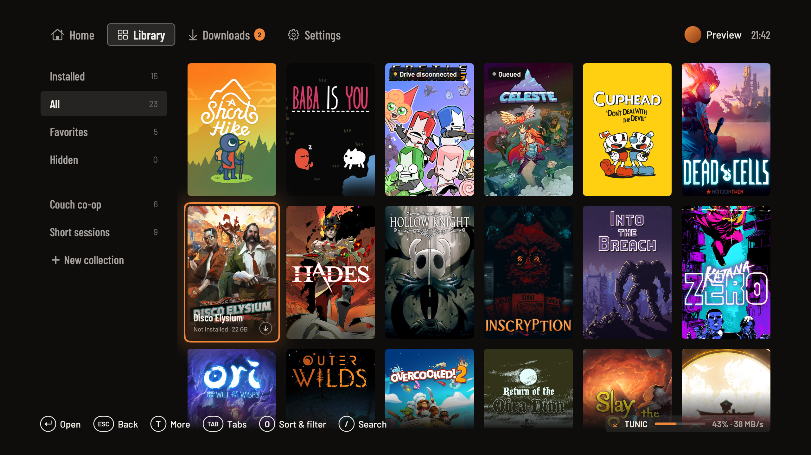

# Playden

**Windows games on your Mac, from the couch.**

| Store | Builds |
|---|---|
| Steam | Windows and Mac |
| Epic Games Store | Windows |
| GOG | Windows and Mac |
| This Mac | Mac games you already have installed |

Playden is a controller-first launcher for Apple Silicon. It puts all your stores in one library,
installs each Windows game into its own [CrossOver](https://www.codeweavers.com/crossover)
environment, runs Mac builds natively, and gets you from the sofa to the game without bottles,
shortcuts or the desktop.



*Actual app capture using the sample library. Displayed games are not a compatibility list.*

**Version 0.2, in active development.**

## Features

- **One couch-friendly library** with cover art, search, filters, collections, favorites and your
  own compatibility notes. Works with a controller, keyboard or mouse.
- **Downloads you can manage**: a queue with pause, resume, reorder, retry, verify and uninstall,
  on any drive you choose.
- **Per-game settings**: curated runtime profiles plus graphics translator (D3DMetal, DXVK, DXMT),
  Windows version, launch options, overlays and more.
- **Steam Cloud saves** sync before and after you play, with conflict resolution and offline play.
- **Built for the TV**: preferred-monitor placement, an immersive mode that hides other displays,
  and on-screen logs and retry when something fails.

## Requirements

- An Apple Silicon Mac with macOS 15 or newer
- [CrossOver](https://www.codeweavers.com/crossover) 26.x with a license or trial, for Windows
  games. It is a separate, paid product and is not included. Mac games do not need it.
- Any game controller, or a keyboard and mouse

## Build

Install Xcode 26.3 with its command-line tools, then from this repository:

```sh
brew install xcodegen xz zstd llvm lld
./scripts/build-release.sh
```

Drag the revealed **Playden.app** into **Applications**. To update, pull, rebuild and replace the
app; your library and settings are kept. No Apple Developer membership is needed. Debug builds,
preview mode and signing options are in [Development](docs/DEVELOPMENT.md).

On first launch, open CrossOver once to activate it, then follow Playden's setup to pick a
display, sign in to your stores and choose a games drive.

## Limitations

- A game in your library is not guaranteed to run under CrossOver.
- Cloud saves are Steam-only for now.
- GOG games that need DirectX, .NET or Visual C++ installers from GOG may not start yet.
- Games with anti-cheat do not work. Epic games that need the EA app or Ubisoft Connect are not listed.
- Keep Playden open while downloading or playing. Game updates are not available yet.

Plans and requirements are in the [PRDs](docs/prd/README.md).

## License

Playden is free software, licensed under the [GNU General Public License v3.0](LICENSE) or
any later version. Parts of the Steam library descend from
[GameNative](https://github.com/utkarshdalal/GameNative) and
[Pluvia](https://github.com/oxters168/Pluvia), which are also GPL-3.0. Third-party components are
listed in [THIRD_PARTY_NOTICES.md](THIRD_PARTY_NOTICES.md). The bundled Steamless release is
CC BY-NC-ND 4.0, so redistributing Playden with it is limited to noncommercial use.

Playden is an independent project and is not affiliated with Valve Corporation, Epic Games,
GOG or CodeWeavers, Inc. Steam, Epic Games Store, GOG and CrossOver are trademarks of their
respective owners.
